# Personal Portfolio Website

A modern, professional and fully responsive personal portfolio website built with **HTML5** and **CSS3** only.
Created by **Rana Asad Ullah** for the **Devixo Solutions Web Development Internship Program** (Task 01).

## Project description

This website showcases my profile, technical skills, education, projects and contact information through a clean and attractive interface.
It is written entirely by hand: no Bootstrap, Tailwind CSS, UI frameworks, downloaded templates or JavaScript were used.
The layout adapts smoothly to desktop, laptop, tablet and mobile screens.

## Technologies used

| Technology | Purpose |
|------------|---------|
| HTML5 | Semantic page structure (`header`, `nav`, `main`, `section`, `article`, `footer`, `form`) |
| CSS3 | Custom properties, CSS Grid, Flexbox, media queries, transitions and hover effects |
| Google Fonts | Bricolage Grotesque (headings) and Figtree (body text) |
| Font Awesome | Integrated icons to enhance the website’s visual appeal and improve user navigation |
| Git and GitHub | Version control and hosting |

## Website features

- Sticky navigation bar with a mobile hamburger menu (pure CSS, no JavaScript)
- Hero section with name, tagline, short introduction, profile image and call-to-action buttons
- **About** section with personal introduction, academic background and career interests
- **Skills** section with skill cards and progress indicators: HTML, CSS, JavaScript, ReactJS, NodeJS, Git/GitHub etc
- **Education** section with degree, university, study period and relevant coursework
- **Projects** section with three project cards (image, description, technologies, GitHub/demo links)
- **Contact** section with email, phone, location, social links and a contact form UI
- Two-part footer: social icons (LinkedIn, Instagram, GitHub, WhatsApp) above a divider, with copyright and navigation links below
- Smooth scrolling between sections
- Subtle hover animations on buttons, links, skill cards, project cards and social icons
- Consistent colour theme, readable typography and good contrast
- Fully responsive: no unnecessary horizontal scrolling on any screen size

### Colour theme

| Colour | Hex | Use |
|--------|-----|-----|
| Ink | `#12203A` | Text, footer |
| Blue | `#223679` | Buttons, links |
| Sun | `#FFC83D` | Accent colour |
| Paper | `#F4F6F9` | Page background |
| White | `#FFFFFF` | Cards |

## Project structure

```
portfolio/
├── index.html          # Page content
├── style.css           # All styling
├── README.md           # Project documentation
├── images/
│   ├── favicon.png
│   ├── profile.jpg
│   ├── project1.jpg
│   ├── project2.jpg
│   └── project3.jpg
└── screenshots/        # Screenshots used in this README and the report
```

## Screenshots

### Desktop view

| Home | About |
|------|-------|
| 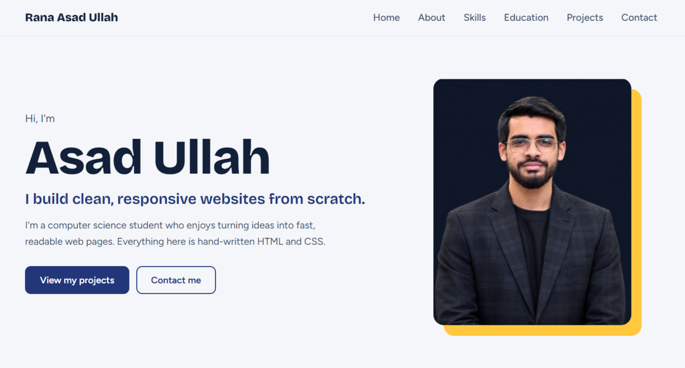 | 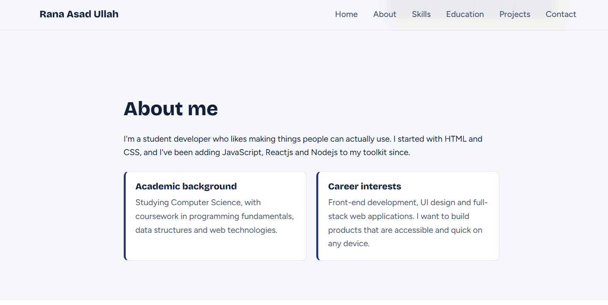 |

| Skills | Education |
|--------|-----------|
| 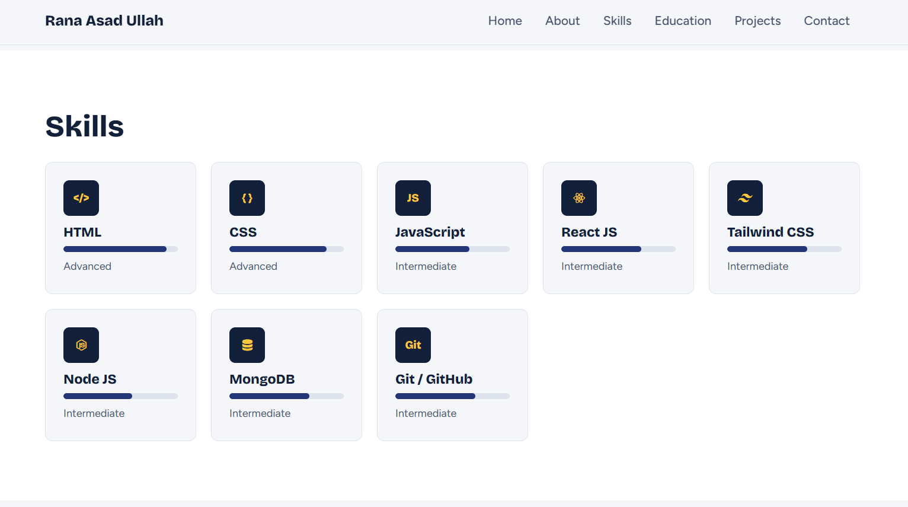 | 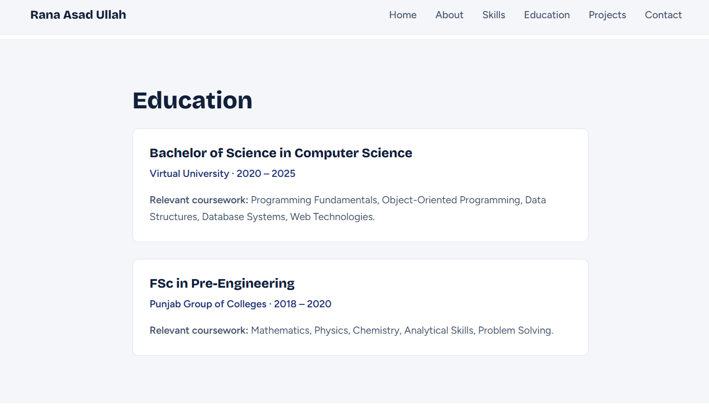 |

| Projects | Contact |
|----------|---------|
| 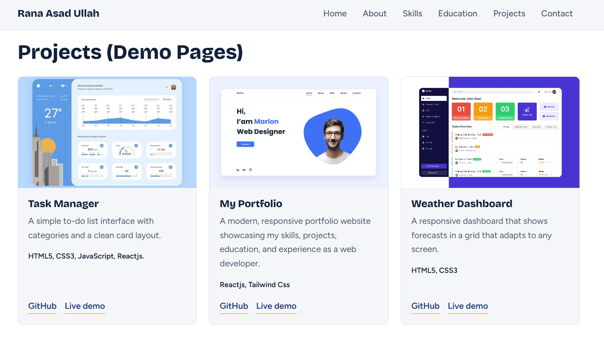 | 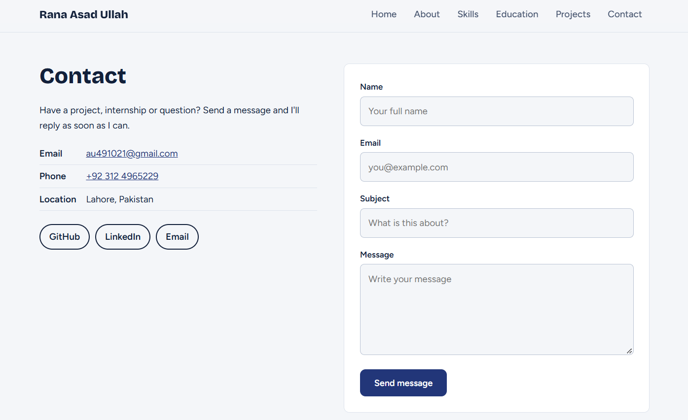 |

**Footer**

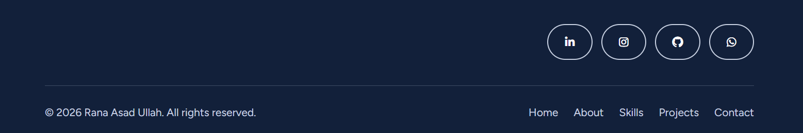

### Tablet view

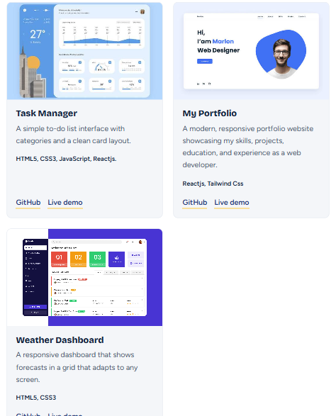

### Mobile view

| Home | Education | Skills | Projects |
|------|------|--------|----------|
| 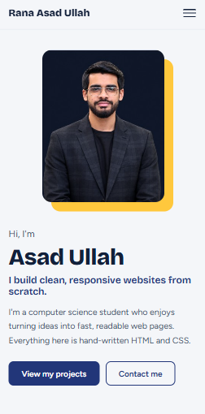 | 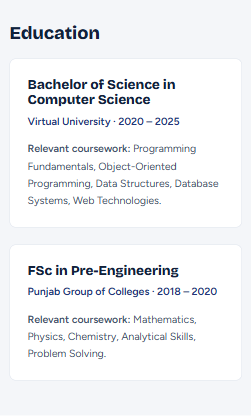 | 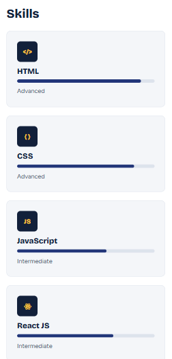 | 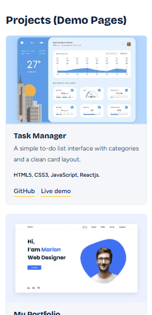 |

## Instructions for running the website

No installation or build step is needed.

1. Clone the repository:
   ```bash
   https://github.com/ranaasadullah/my-portfolio.git
   ```
2. Open the project folder:
   ```bash
   cd my-portfolio
   ```
3. Open `index.html` in any modern web browser (Chrome, Edge, Firefox or Safari), either by double-clicking the file or by right-clicking it and choosing **Open with** your browser.

An internet connection is only needed to load the Google Fonts, Font Awesome(Icons). Without it, the site falls back to system fonts or no icons.

## Author

**Rana Asad Ullah**
Web Development Intern, Devixo Solutions
GitHub: https://github.com/ranaasadullah
